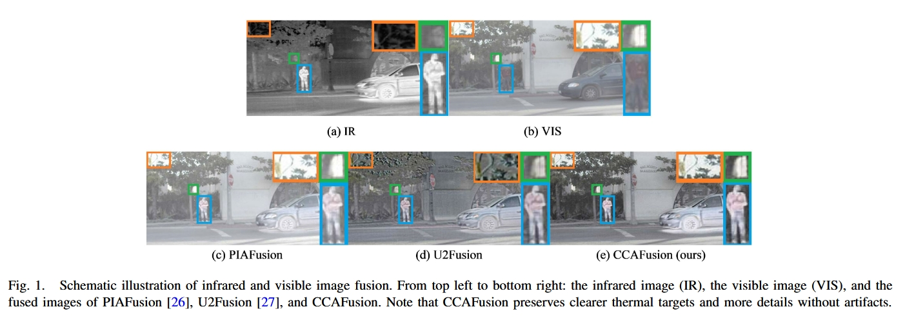
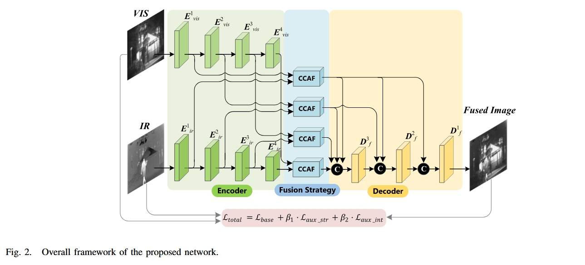
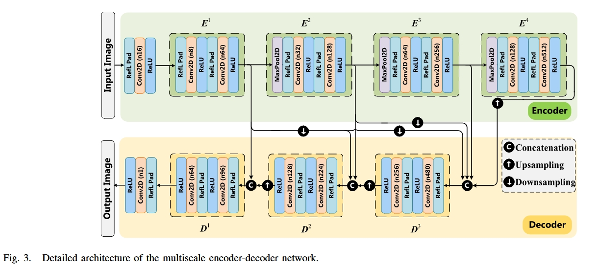
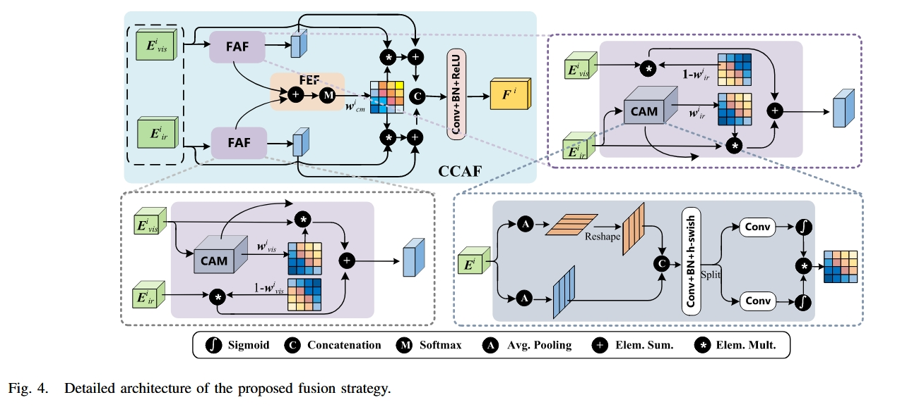
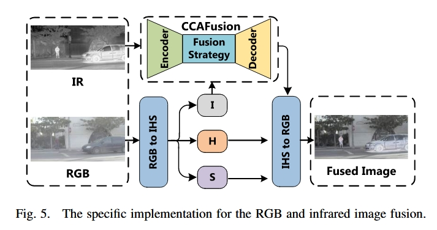

Title: CCAFusion: Cross-Modal Coordinate Attention  Network for Infrared and Visible Image Fusion

labels: #imagefusion 

# Brief

该论文设计了跨模态图像融合策略：特征感知融合模块+特征增强融合模块，开发了新的多约束损失函数，应用了多尺度跳跃链接网络，引入了坐标注意力机制。

**数据类型**: RGB-灰度 & RGB-IR

# Translation

## Abstract

红外和可见光图像融合旨在生成具有全面信息的图像。它可以保持丰富的纹理特性和热信息。然而，对于现有的图像融合方法，融合图像要么牺牲了热目标的显著性和纹理的丰富性，要么引入了伪影等无用信息的干扰。

为了缓解这些问题，该文提出了一种有效的红外可见光图像融合跨模态坐标注意力网络CCAFusion。为了充分融合互补特征，设计了基于坐标注意力的跨模态图像融合策略，该策略由 **特征感知融合模块** 和 **特征增强融合模块组成**。此外，采用基于 **多尺度跳跃连接的网络** 在红外图像和可见光图像中获得多尺度特征，在融合过程中可以充分利用多级信息。为了减少融合图像与输入图像之间的差异，该文开发了包括 **基数损失** 和 **辅助损失** 的多重约束损失函数，以调整融合图像中的灰度分布，保证结构和强度的和谐共存，从而防止伪影等无用信息的污染。

在广泛使用的数据集上进行的广泛实验表明，我们的 CCAFusion 在定性评估和定量测量方面都取得了优于最先进的图像融合方法的性能。此外，在显著目标检测中的应用揭示了我们的 CCAFusion 在高级视觉任务中的潜力，可以有效地提高检测性能。

## Introduction

红外和可见光图像融合旨在生成一个具有全面信息的图像。它可以在可见光图像中保持丰富的纹理特性，在红外图像中保持热信息，从而促进在光线变化、遮挡和背景杂波等具有挑战性的情况下获取关键信息的能力。图像融合一直是许多应用程序的重要预处理，用于准确识别复杂场景中的潜在现象。特别是，图像融合可以在广泛的多模态高级视觉任务中发挥作用，例如视频监控 、语义分割和目标检测。

图像融合的早期研究主要采用多尺度变换方法、稀疏表示方法、基于显著性的方法、基于子空间的方法、混合方法和其他方法来合并不同的模态图像。这些传统的融合方法对红外和可见光图像融合任务产生了积极影响。然而，他们采用的手工制作特征具有有限的表现能力，导致融合图像中出现空间扭曲，如伪影和不完整信息。

最近，基于深度学习的方法因其出色的特征提取能力而被引入图像融合任务中。现有的基于深度学习的融合方法主要基于卷积神经网络（CNN）框架、生成对抗网络（GAN）框架和自编码器（AE）框架。尽管基于深度学习的图像融合方法产生了有希望的融合结果，但仍然存在一些限制。首先，一些图像融合方法采用简单的方法将特征从源图像传输到融合图像。例如，两篇论文中预先设计的融合规则只是简单地对特征图进行平均以获得融合的特征。但是，从源图像中提取的特征可能无法以这种直接方式完全利用。其次，由于图像融合中缺乏理想的真实数据，难以平衡源图像和融合图像之间的差异，甚至在融合图像中引入伪影等无用信息的干扰。为此，一些工作探索了基于 GAN 框架的图像融合方法。尽管基于 GAN 的融合方法保留了大部分细节，但对于 GAN 网络来说，要充分利用多模态图像中的代表性信息是困难的。第三，在整合源图像的有意义信息时，通过基于 AE 的融合方法提取的特征在没有任何适当指导的情况下被合并。为了区分不同特征的重要性，最近在基于 AE 的融合框架中引入了注意力机制。例如，提出了一种基于卷积块注意力模块（CBAM）的融合策略来表达每个空间位置和每个通道的重要性。这种图像融合方法产生了良好的融合结果。但是，这种融合方法并未探索特征融合过程中的跨特征和长程依赖关系。此外，大规模池化用于捕获局部相关性，导致位置信息的丢失。

受最近关于注意力机制和 Densefuse 工作的启发，我们提出了一种有效的红外和可见光图像融合跨模态坐标注意力网络 CCAFusion，旨在缓解图像融合方法中的上述问题。与传统的基于深度学习的融合方法相比，我们的 CCAFusion 通过引入通道和位置重要性来开发跨模态坐标注意力来指导特征融合。同时，在特征融合过程中探索跨特征和长距离依赖关系，以避免大规模全局池化导致的位置信息丢失。为了集成互补特征，我们在融合策略中设计了特征感知融合模块和特征增强融合模块。此外，采用基于多尺度跳跃连接的网络来获得红外图像和可见光图像中的多尺度特征。从形式上讲，CCAFusion 包括编码器块、融合块和解码器块。我们利用跨模态坐标注意力融合块来实现每个级别的跨模态融合。这些跨模态融合特征基于跳跃连接架构被馈送到解码器块中，最终的融合图像从高层次信息逐渐重构到低层次信息。此外，针对图像融合中缺乏理想的真实数据的问题，我们设计了一个新的损失项来约束网络训练，即多重约束损失函数。为了直观地展示 CCAFusion 的优势，图 1 显示了红外和可见光图像融合的示意图，并表明 CCAFusion 可以有效地保持热目标和纹理特征，而不会产生伪影。

综上所述，我们的主要贡献如下：

1. 我们提出了一种新颖的红外可见光图像融合跨模态坐标注意力网络（CCAFusion），在图像融合任务中取得了优异的性能。此外，在显著目标检测上的扩展应用表明，CCAFusion 可以促进后续高级视觉任务的检测性能。
2. 我们设计了一种简单而有效的跨模态图像融合策略，包括特征感知融合模块（FAF）和特征增强融合模块（FEF）。FAF 旨在集成基于单模态注意力权重的互补特征。FEF 用于通过跨模态注意力权重来促进互补特征。聚变模块上的消融实验评估了我们的聚变策略的有效性，并表明 FAF 和 FEF 协同工作，使我们的聚变网络能够保留丰富的信息。
3. 我们开发了一个用于图像融合的多重约束损失函数。具体来说，这项工作提出了一种新的基础损失（base loss），通过 KL 散度在融合图像和源图像之间施加类似的灰度分布，同时保留基础信息。此外，辅助损失（auxiliary loss）可以保持详细信息和热辐射信息。通过开发的损失函数训练的 CCAFusion 可以合理调整灰度分布，保证结构和强度的和谐共存，从而防止伪影污染（artifact pollution）。损失函数的消融实验证明了每个损失项的有效性和不同的贡献。

在本文的其余部分，我们在第二节中回顾了图像融合方法的相关工作。在第三节中，我们详细描述了 CCAFusion 网络。在第四节中，我们在公共数据集上进行了图像融合实验。在第五节中，给出了结论。

## Related Works

在本节中，我们首先回顾经典的图像融合算法。然后，我们介绍了有关基于深度学习的图像融合方法的最新研究。

### A. Classical Image Fusion Methods

经典的图像融合方法可以分为六种类型：多尺度变换方法、稀疏表示方法、基于显著性的方法、基于子空间的方法、混合方法和其他方法。最常用的方法是多尺度转换和稀疏表示。

作为经典图像融合方法中的一个代表性分支，多尺度变换方法旨在将源图像分解为不同的尺度。随后，这些不同尺度的特征通过逆变换进行组合。传统的多尺度变换方法包括拉普拉斯金字塔变换（LAP）、非二次采样轮廓变换（NSCT）和离散小波变换（DWT）。Madheswari 和 Venkateswaran 提出了一个使用 DWT 的图像融合框架，并使用粒子群优化技术将热图像与可见光图像相结合，该技术优于大多数多分辨率融合技术。

经典图像融合方法的另一个典型分支是稀疏表示方法。基于稀疏表示的融合方法的目标是使用超完整的字典来表示源图像。然后根据融合规则对超完整字典中的稀疏表示系数进行积分，得到融合后的图像。为了在字典构建中收集足够的特征表示，Wang et al. 提出了一种基于形态学、随机坐标编码和同步正交匹配跟踪的图像融合方法。考虑到由于稀疏表示的滑动窗口技术而经常引入伪影（artifact），开发了一种卷积稀疏表示来学习对应于整个源图像的系数。Liu et al. 采用卷积稀疏表示来缓解图像融合任务中细节保留不佳的问题。

### B. Deep Learning-Based Image Fusion Methods

最近，基于深度学习的方法由于在提取特征方面具有出色的能力，在图像融合方面取得了重大进展。根据图像融合任务中采用的网络架构的特点，基于深度学习的融合方法可以分为基于CNN的融合框架、基于GAN的融合框架和基于AE的融合框架。

基于 CNN 的融合方法采用卷积算子提取突出特征并获得加权图。Liu等首先使用CNN进行图像融合。由于这项工作依赖于二进制映射，因此该网络仅适用于多焦点图像融合。为了融合红外图像和可见光图像，Li等将源图像分为基础部分和细节部分。对于详细的部分，他们根据深度学习网络收集的特征创建了权重。随后，Zhang 和 马 构建了一个用于融合任务的挤压和分解模型，该模型采用自适应决策块来推动优化目标，并调整权重以改变不同输入图像的信息比例。

基于 GAN 的融合方法充分利用了概率分布估计的能力来生成融合图像，该图像基于生成器和判别器之间的博弈。GAN框架由马等人创造性地纳入图像融合任务。他们使用判别器来驱动生成器以获得融合图像。然而，单个判别器可能会导致模式崩溃，这意味着融合图像偏向可见光图像或红外图像。此外，中的 FusionGAN 相对不稳定，因为它依赖于对抗性学习来学习特征。因此，融合的结果在 FusionGAN 中缺乏纹理。为了保持红外图像和可见光图像之间的平衡，马 等提出了一种双判别器条件生成对抗网络。为了更好地整合源图像的纹理信息，Yang 等基于纹理条件生成对抗网络构建了图像融合网络。

基于 AE 的融合方法采用自编码器架构来实现特征提取和特征重建。Li 和 Wu 提出了一种基于编码器和解码器的红外和可见光图像融合方法，称为 Densefuse。然而，Densefuse 在融合层中采用了直接添加策略来组合显着特征，从而限制了融合性能。为了缓解这个问题，Xu 等提出了一种基于 AE 的图像融合框架，该框架具有基于像素级分类显著性的融合规则，突破了将深度学习应用于融合规则的瓶颈。最近，注意力机制已被引入图像融合任务中。Li 等人提出了一种基于 CBAM 的融合策略。这种融合策略考虑了每个空间位置和每个通道的重要性。同样，Wang等也在融合层中构建了空间注意力和通道注意力模型。与 CBAM 中的 Nestfuse 方法不同，L1-范数和均值操作与注意力模型相结合，为显着特征生成权重图。

基于深度学习的融合方法提供了有竞争力的融合性能。但是，仍有一些缺点需要解决。首先，图像融合不仅具有关键信息集成的优势，而且可以促进高级视觉任务。然而，之前发表的融合方法只关注融合图像的视觉质量和统计指标，而忽略了图像融合在高级视觉任务中的应用。与这些方法不同的是，我们的方法不仅在图像融合任务中取得了优异的性能，而且有助于提高后续高级视觉任务的检测性能，这从扩展到显著目标检测中得到了证明。其次，一些融合策略基于直接手工制作的规则，在整合源图像的有意义信息时没有任何适当的指导，例如加法操作。相比之下，我们设计了一种基于注意力机制的新型跨模态图像融合策略，可以在注意力机制的指导下整合源图像的有意义信息。尽管中基于通道注意力机制的方法可以指示模型将更多的注意力集中在重要内容上，但在特征融合过程中忽略了长期依赖性。与通道注意力的方法不同，我们的方法采用坐标注意力设计了特征感知融合模块和特征增强融合模块，它们可以同时捕获信道和位置重要性以及远程依赖性。第三，相同场景的图像往往具有相似的灰度分布，这可以反映图像融合中的基础信息，但现有的方法忽略了这一点。相比之下，我们遵循同一场景中灰度分布相似的事实，并开发了一个新的损失函数，通过 KL 散度在融合图像和源图像之间施加相似的灰度分布，从而保留基础信息。

## PROPOSED METHOD

在本节中，我们首先讨论我们方法的动机。然后，我们介绍了 CCAFusion 的整体架构，并详细说明了跨模态坐标注意力融合策略。按顺序，我们给出了设计的多重约束损失函数的细节。最后，我们陈述了 CCAFusion 用于 RGB-红外图像融合的具体框架。

### A. Motivation

红外可见光图像融合旨在获得信息全面的一幅图像，在可见光图像中保留丰富的纹理特征，在红外图像中保留热信息。然而，红外和可见光图像是由具有不同成像机制的不同传感器生成的，导致源图像之间存在域差异。域差异是红外和可见光图像融合任务的巨大挑战，因为很难平衡源图像之间重要特征的差异。当源图像的结构和强度无法和谐共存时，融合图像的高对比度边缘区域往往会出现许多伪影。此外，由于特征表示有限且融合过程中的重要信息丢失，现有红外可见光图像融合方法的融合结果也容易受到不良伪影的影响，这不可避免地影响最终性能。通过考虑上述局限性，我们提出了一种新的红外和可见光图像融合网络，旨在实现充分的特征保留、强大的特征表示和重要特征的和谐共存，从而避免为融合图像引入不良伪影。

### B. Overview

所提出的网络遵循双流模型，其中包括四个编码器块 $(E_j^i, \ i \in \{1,2,3,4\} ,\ j \in \{ir, vis\})$、四个融合块和三个解码器块 $(D^i_f,\ i \in \{1,2,3\})$。图 2 说明了所提出的网络的整体框架。具体来说，首先将红外图像和可见光图像分别馈入双流特征提取网络。每个流的主干是一个编码器-解码器网络，它基于多尺度跳跃连接架构，如图 3 所示。编码器块旨在提取每个级别的深层特征。然后，我们将编码器块的输出传送到跨模态坐标注意力融合块 （CCAF），从而实现每个级别的跨模态融合。这些跨模态融合特征依次被馈送到基于跳跃连接架构的解码器块中，最终的融合图像从高层次信息逐渐重构到低层次信息。

下面提供了编码器-解码器网络的详细架构。编码器-解码器网络的灵感来自 Densefuse。与  Densefuse 通过基于密集连接的网络获取重建图像的架构不同，我们采用了基于多尺度跳跃连接的编码器-解码器网络，以充分利用红外图像和可见光图像中的多尺度特征，如图 3 所示。每个流中的编码器由四个块组成，其中每个块包括两个 Padding 层、两个卷积层和两个 ReLU 层。第一卷积层和第二卷积层中的核大小分别为 $3 \times 3$ 和 $1 \times 1$。通过多尺度跳跃连接架构和串联作对不同尺度提取的特征进行集成。然后将结果分别输入到三个 decoder 块中。与编码器部分类似，解码器的每个块都包含两个 Padding 层、两个卷积层和两个 ReLU 层。卷积层的通道号如图 3 所示。通过将通道数减少到 1 来生成输出图像。

### C. Fusion Strategy

可见图像包含丰富的纹理特征。红外图像显示了热辐射特征。这两种类型的功能在复杂环境中是互补的，例如背景杂波、遮挡和光线变化。考虑到不同的空间信息和渠道扮演着不同的角色，在整合这些互补特征时，我们应该关注有用的信息。因此，在融合策略中引入了一种新的注意力机制来区分特征的重要性。

注意力机制已被广泛研究和应用于各个领域，可以指导模型将更多的注意力集中在重要内容上。最著名和最广泛使用的方法是挤压和激励 （SE） 注意力。但是，在 SE 模块中忽略了位置信息的重要性，该模块仅考虑通道之间的信息。CBAM 同时考虑了通道信息和位置信息，这在中被用于图像融合。然而，这种注意力机制缺乏长期依赖性。我们的融合策略是基于坐标注意力开发的，它可以同时捕获通道和位置重要性以及长期依赖性。图 4 显示了我们的跨模态融合策略的具体结构，它包括两个关键部分：特征感知融合模块 （FAF） 和特征增强融合模块 （FEF）。

我们采用 FAF 来整合互补特征，包括可见光图像中的纹理特征和红外图像中的热辐射特征。首先，将可见光流产生的第 i 个特征 $E^i_{vis}$ 和红外流产生的第 i 个特征 $E^i_{ir}$ 馈送到 CCAF。我们采用坐标注意力模块（CAM）来获得权重矩阵 $w^i_{vis}$ 和 $w^i_{ir}$ ，分别反映了可见光特征和红外特征的重要性。CAM 的具体结构如图 4 的右下角所示。给定大小为 $C \times H \times W$ 的第 i 个输入特征 $E^i$，我们采用池化核 $(H， 1)$ 和 $(1， W)$ 分别沿水平坐标和垂直坐标编码不同通道的信息。高度 h 处第 c 通道的过程定义如下：

$$
y_{i \_ c}^h (h) = \frac1W \sum_{0\leq l <W} E^{i \_ c} (h,l)
$$

同样，宽度为 w 的第 c 个通道的过程定义如下：

$$
y_{i \_ c}^w (w) = \frac1H \sum_{0\leq k <H} E^{i \_ c} (k.w)
$$

上述两个过程产生了一对沿两个空间方向的方向感知特征图，这使得注意力块能够沿一个空间方向捕获长距离依赖关系，并沿另一个空间方向保留精确的位置信息，从而帮助网络准确定位感兴趣对象的位置。CAM 的直观效果在第 IV-F.3 节中详细介绍。

为了生成重塑的 $y^h_{i \_ c} (h)$ 和 $y_{i \_ c}^w (w)$ 的聚合特征图，我们将它们连接起来，并通过 $1 \times 1$ 卷积作将通道数减少到 $C/r$。r 是还原无线电，设置为 32。公式如下：

$$
f = \delta (F_1([y^h_{i \_ c} (h), \ y_{i \_ c}^w (w)]))
$$

其中 $[\cdot,\ \cdot]$ 是串联运算。$F_1$ 表示 $1\times 1$ 卷积变换函数。$\delta$ 是 H-SWISH 激活函数 [54]。然后将输出特征图 $f \in R^{C/r \times (H+W)}$ 分解为单独的张量 $f^h \in R^{C/r\times H}$ 和 $f^w \in R^{C/r\times W}$ 。为了将通道数恢复到 C，我们使用两个 $1 \times 1$ 卷积变换函数 $F^h_1$ 和 $F^w_1$。 权重矩阵 $w^i$ 是 $F^h_1$ 和 $F^w_1$ 的乘积输出，可以写成：

$$
w^i = \sigma (F_1^h(f^h)) \times \sigma (F_1^w(f^w))
$$

其中 $\sigma$ 是 sigmoid 函数。我们可以通过将 $E^i_{vis}$ 和 $E^i_{ir}$ 输入到 CAM 中来获得权重矩阵 $w^i_{vis}$ 和 $w^i_{ir}$。然后，将这两个权重矩阵与输入特征相乘，以专注于融合任务的重要特征并抑制不必要的特征，描述如下：

$$
F^i_{ir} = E^i_{ir} * w^i_{ir} + E^i_{vis} *(1-w^i_{ir})
$$

$$
F^i_{vis}= E^i_{vis} * w^i_{vis} + E^i_{ir} * (1-w^i_{vis})
$$

$F^i_{ir}$ 和 $F_{vis}^i$ 是 FAF 的结果。此外，一些纹理特征也反映在红外图像中，一些热辐射特征也反映在可见光图像中。
因此，FEF 被应用于促进这些互补特征。我们首先聚合权重矩阵 $w^i_{vis}$ 和 $w^i_{ir}$ 。 然后将聚合结果馈送到 softmax 函数，并获得跨模态权重矩阵 $w^i_{cm}$，表示为：

$$
w^i_{cm} = softmax(w^i_{vis} + w^i_{ir})
$$

基于跨模态权重矩阵 $w^i_{cm}$，通过将 FAF 结果和 FEF 结果相加来获得增强特征 $F^i_{IR}$ 和 $F^i_{VIS}$，表示为：

$$
F^i_{IR} = F^i_{ir} + E^i_{ir} * w^i_{cm}
$$

$$
F^i_{VIS} = F^i_{vis} + E^i_{vis} * w^i_{cm}
$$

将可见分支和红外分支生成的增强特征进一步串联并馈送到卷积层，得到跨模态融合特征 $F^i$。公式表示如下：

$$
F^i = Conv ([F^i_{VIS},F^i_{IR}])
$$

### D. Loss Function

针对图像融合中缺乏理想的地表实况数据的问题，我们从多个方面设计了网络训练的损失函数，以在红外和可见光图像融合任务中保留更有意义的信息。

一方面，我们认为同一场景中的灰度分布相似。有鉴于此，我们将灰度分布和 Kullback-Leibler （KL） 发散损失相结合，设计了基数损失 $\mathcal{L}_{base}$，其公式为：

$$
\mathcal{L}_{base} = ((KL(S(p_f)||S(q_{ir}))^2 + KL(S(p_f)||S(q_{ir}))^2)/2)^{1/2}
$$

其中 $q_{ir}$ 和 $q_{vis}$ 分别表示红外图像和可见光图像的灰度分布。$p_f$ 代表融合图像的灰度级分布。$S(\cdot)$ 表示 softmax 函数，用于重新缩放元素。KL 散度用于在融合图像和源图像之间施加类似的灰度级分布，以便维护源图像中的基本信息。

另一方面，我们认为在融合图像中应充分保证详细信息和热辐射信息。融合图像的细节可以表示为红外和可见光图像纹理的最大集合，从而保持丰富的细节信息。元素级最大选择表示融合图像的最佳强度分布，从而突出显示热辐射信息。基于这些点，我们构建了一个辅助结构损失 $\mathcal{L}_{aux \_ str}$ 和一个辅助强度损失 $\mathcal{L}_{aux \_ int}$ ，可以表示为：

$$
\mathcal{L}_{aux \_ str} = \Vert |\nabla I_f | - \max( |\nabla I_{ir}| , |\nabla I_{vis}|) \Vert_1 
$$

$$
\mathcal{L}_{aux \_ int} = \Vert I_f - \max( I_{ir}, I_{vis}) \Vert_1 
$$

其中 $I_f$ 、 $I_{ir}$ 和 $I_{vis}$ 分别是融合图像、红外图像和可见光图像。$\nabla$ 表示梯度运算符。

最后，CCAFusion 的 loss 函数由基数损失和辅助损失两部分组成。辅助损耗还包括辅助结构损耗和辅助强度损耗。多重约束总损失函数 $\mathcal{L}_{total}$ 表示如下：

$$
\mathcal{L}_{total} = \mathcal{L}_{base} + \beta_1 \cdot \mathcal{L}_{aux \_ str} + \beta_2 \cdot \mathcal{L}_{aux \_ int}
$$

其中 $\beta_1$ 和 $\beta_2$ 是权重，用于在不同项目之间取得平衡。有关 $\beta_1$ 和 $\beta_2$ 值的具体调整在第 IV-B.1 节中演示。

### E. RGB-Infrared Fusion

在前面的内容中，所述的融合过程是针对灰度可见光和红外图像的。对于 RGB 和红外图像融合，我们可以先将 RGB 图像转换为 IHS 色彩空间。I 表示强度通道。H 和 S 分别代表色相通道和饱和度通道。由于主要的空间信息分布在 I 通道中，因此我们可以利用 CCAFusion 将红外图像和 RGB 图像生成的 I 通道进行合并。在将融合的 I 通道与 H 和 S 通道组合后，可以通过转换为 RGB 色彩空间来获得最终的融合图像。RGB 和红外图像融合的相应架构如图 5 所示。

## EXPERIMENTS AND RESULTS

暂略

# Notes

不使用通道注意力（如SE模块），而是采用了坐标（像素角度）的注意力机制，可以同时学到通道、位置和长程依赖

### 长程依赖

距离较远的局部关系

eg. "The cat, which chased the dog that ran across the field and jumped over the fence, was black." 句子开头的 "cat" 和结尾的 "was" 之间有直接的主谓一致关系。

eg. 在图像中： 想象一张全身人像照片。人的眼睛（在图像上方）和他的鞋子（在图像下方）在空间上相距很远。

SE模块简单粗暴的在S阶段直接将每一个通道的特征图压缩成了一个点（使用全局平均池化），从根本上失去了学习到位置信息的机会。

而坐标注意力，则分别在x轴y轴两个方向做单列单行的池化，保留了特征x，y坐标的信息，从而能够学习到位置与方向信息，从而学习到了长程依赖关系。

### Artifact pollution 指的是什么？

简单来说，"Artifact pollution" 指的是在图像融合过程中，由于算法不完美，导致最终生成的图像中出现了各种不自然的、错误的视觉效果。

文中引用的这段话是在讨论“传统”图像融合方法的局限性。这些方法依赖于人工设计的特征（hand-crafted features），能力有限，因此在融合红外和可见光图像时，常常会出现以下几种典型的“伪影”：

光晕效应 (Halo Artifacts)：在物体边缘，特别是高对比度的区域（比如天空和建筑物的交界处），出现一圈不自然的亮边或暗边，像光晕一样。这是最常见的伪影之一。

鬼影或模糊 (Ghosting or Blurring)：如果两张源图像没有完全对齐，或者算法处理不当，会导致物体的边缘变得模糊、出现重影，看起来不清晰。

块效应 (Blocking Artifacts)：在一些基于块处理的算法中，融合图像上可能会看到明显的小方块边界，使得图像看起来像马赛克一样不平滑。

纹理失真或丢失 (Texture Distortion/Loss)：算法可能无法很好地保留可见光图像中的精细纹理（如墙壁的砖缝、树叶的脉络），导致融合图像的一部分变得平滑、模糊，丢失了细节。

对比度失真 (Contrast Distortion)：融合后的图像整体亮度或对比度看起来很奇怪，某些区域过亮或过暗，与人眼观察到的真实世界不符。